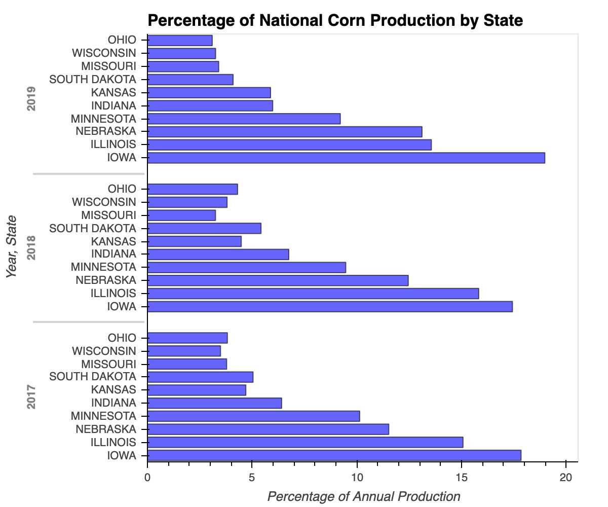
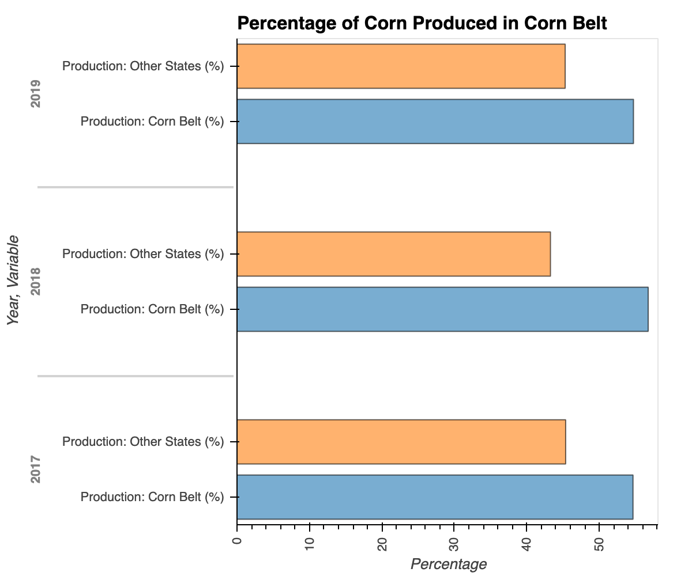
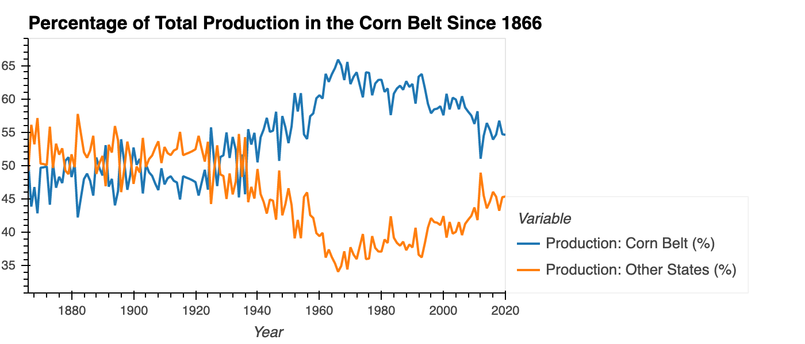
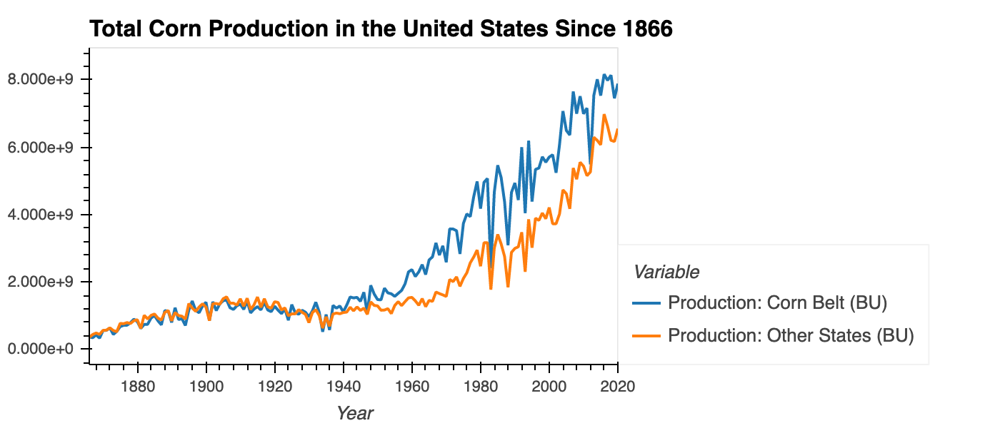
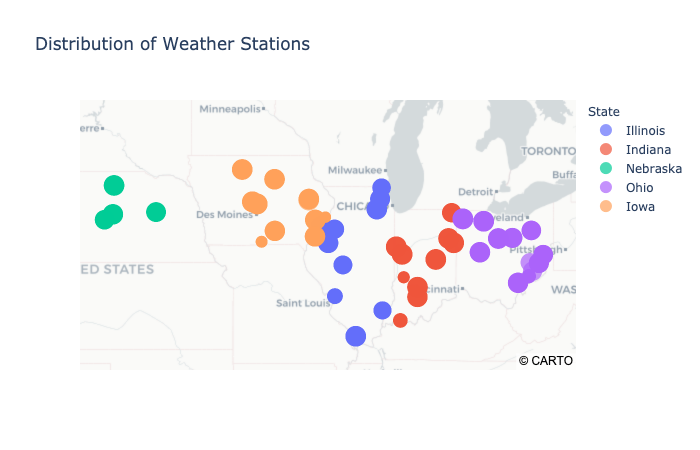
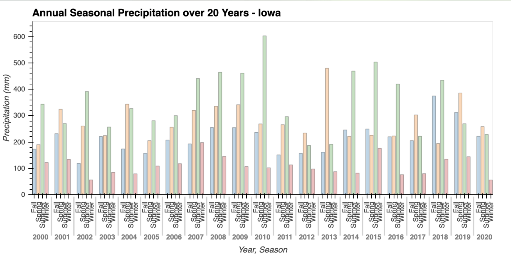
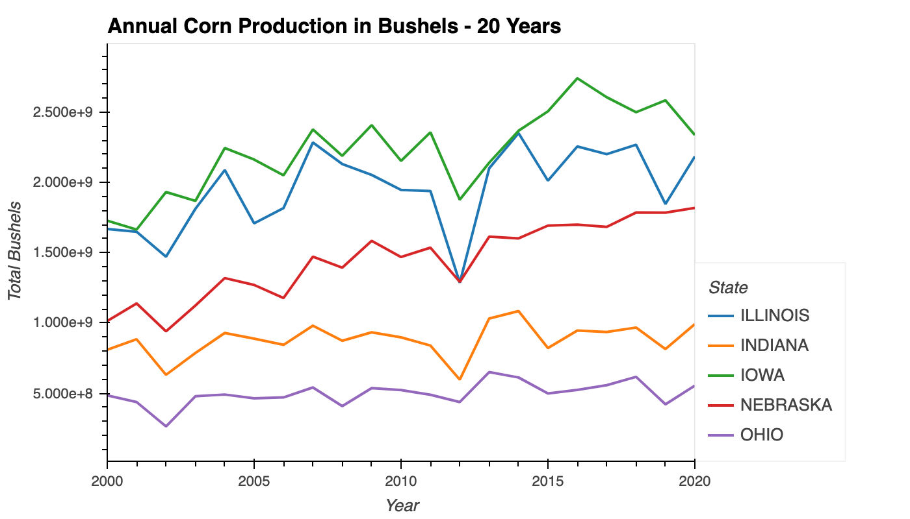

# Analysis of Corn Production and Weather in the United States

## Objective

A dominant factor affecting the supply and consequently the price of corn in the United States is weather. The following workbook will explore the relationship between weather and corn production. The ultimate goal being the to identify relevant data points to include in support of this [project predicting corn prices using weather data.](https://github.com/ShuranXu/FinTech-Project3)

The projected required 20 years worth of weather data from January 1, 2000 to November 30, 2020. However, the long time frame had the potential to create an overwhelming amount of data given the time frame of the project. As such, it was decided to select weather data from the top 5 corn producing states.

### Part 1: Identification of Top Corn Producing States 

The [United States Department of Agriculture: National Agricultural Statistics Service](https://www.nass.usda.gov/) contains hundreds of years of data on US crop production on yields. The information is free to access through download or API.

The graph below shows the top corn producing states over the last three years.

Consistently Iowa outperformed other states in the United States, producing approximately 18% of national corn production annually. Followed by Illinois, Nebraska, Minnesota, and Indiana:

|State      |2017           |2018          |2019          | 
|:----------|:-------------:|:------------:|:------------:|
|Iowa       |2,605,800,000  |2,499,000,000 |2,583,900,000 |
|Illinois   |2,200,950,000  |2,268,000,000 |1,846,200,000 |
|Nebraska   |1,683,300,000  |1,785,600,000 |1,785,420,000 |
|Minnesota  |1,480,220,000  |1,357,720,000 |1,254,250,000 |
|Indiana    |  936,000,000  |  967,680,000 |  814,580,000 |

Unfortunately, there was a miscommunication and in the final selection of our states, Ohio was selected instead of Minnesota, which ranked 10th in the last three years. Anyways- onward!

Production from these 5 selected states needed to be large enough component of national production to affect the overall supply in the U.S. The below graph shows that these five states comfortably produce around 55% of national supply over the last three years:

* Corn Belt: Illinois, Indiana, Nebraska, Ohio, and Iowa 

We would expect to see a shift in the overall supply of corn should this group of states have issues with production.

To explore whether these top states have historically had a stranglehold of corn production in the US, the below graph below the percentage of total historical production of the corn belt compared to all other states in the US since 1866.

* Corn Belt: Illinois, Indiana, Nebraska, Ohio, and Iowa 

While the overall share of corn production by our selected 'corn belt states' is trending downwards, we still see a strong historical share of the overall market. However, the above findings lack context without overall production in bushels. See below:

* Corn Belt: Illinois, Indiana, Nebraska, Ohio, and Iowa 

While production in the corn states generally outstrip the rest of the country, we can see that overall production from the corn states is more volatile than national production.
 
Now that the pertinent states have been selected, data can be extracted from the NOAA's National Centers for Environmental Information (NCEI) Climate Data Online
    
-----
### Part 2: Accessing NOAA's National Centers for Environmental Information (NCEI) Climate Data Online

Climate Data Online provides developers access to historical climate and weather data. The API is broken into seven distinct endpoints branching off the main url `https://www.ncdc.noaa.gov/cdo-web/webservices/v2`.
    
The NOAA contains over 50 different types of daily datapoints for daily summaries alone. The five core datapoints are shown below:

|Name |Description                               |
|:----|:-----------------------------------------|    
|PRCP |Precipitation (tenths of mm)              |
|SNOW |Snowfall (mm)                             |
|SNWD |Snow depth (mm)                           |
|TMAX |Maximum temperature (tenths of degrees C) |
|TMIN |Minimum temperature (tenths of degrees C) |

Since the growing season for corn is between May and October, the choice was made to only select data related to precipitation (PRCP), maximum temperatures (TMAX), and minimum temperatures (TMIN).
    
The NOAA website has over 38,000 weather stations across the United States with varying levels of availability of data. As such, it is difficult to identify singular weather stations to extract. The choice was made to select 10 random weather stations within each state and average their daily readings for PRCP, TMAX, and TMIN. The map below shows the weather stations selected within each state:
    

Minimum/maximum temperatures did not yield any surprises visually. Corn dies below 0 degrees celsius and above 43. However, the temperature did not fall outside of this range within the growing season.
    
Precipitation proved to be more interesting: corn does best with moderate amounts of water. When there is too much water, or too little, the crops suffer. Below shows precipitation by season in Iowa over the last 20 years:

    
In 2010, Iowa experienced excessive rainfall, followed by two years of drought. When comparing these events to corn production, you can see a decline in production:
    

---

## Conclusion

While precipitation appears to affect corn production, we cannot yet extrapolate that corn production from these states will affect corn prices. See the [full project](https://github.com/ShuranXu/FinTech-Project3) for the results.

